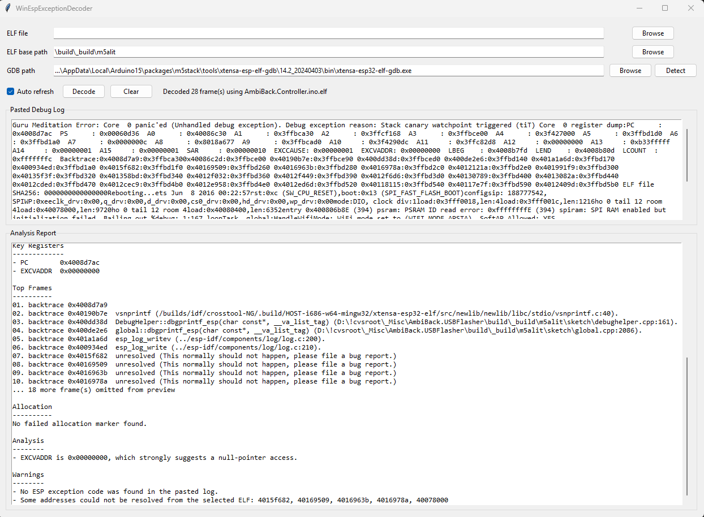

# WinEspExceptionDecoder

Standalone Python GUI application for decoding ESP8266 and ESP32 exception logs from pasted serial output.

## Screenshot

If you add the UI screenshot file to `docs/winespexceptiondecoder-ui.png`, the README will render it here.



## Project lineage

- Original project: [me-no-dev/EspExceptionDecoder](https://github.com/me-no-dev/EspExceptionDecoder)
- Original Arduino IDE plugin by Hristo Gochkov
- Python standalone version by `Andre Lorbach <alorbach@adiscon.com>`

## Features

- Paste raw debug logs into a desktop GUI
- Select a specific firmware `.elf`
- Optionally define a base path that is scanned recursively for `.elf` files
- Auto-detect common Arduino ESP `gdb` toolchains, with manual override
- Decode exception causes, registers, backtraces, and failed allocations
- Show structured analysis and warnings instead of raw command output
- Persist the last-used paths, pasted log, and window geometry
- Run from a local `.venv` with helper scripts for Windows and Unix-like shells

## Requirements

- Windows is the primary target platform for the current version
- Python 3.13 or newer
- Arduino IDE installed locally
- Matching ESP8266 or ESP32 Arduino core/toolchain installed through Arduino IDE
- Access to the compiled firmware `.elf` file for the crash you want to decode

## Arduino IDE dependency

This tool does not replace Arduino IDE. It depends on the toolchain that Arduino IDE installs.

- Arduino IDE is needed so the correct ESP toolchain and `gdb` executable exist on the machine.
- The decoder auto-detects common Arduino IDE package paths such as `Arduino15\packages\...`.
- The selected `.elf` must come from the same firmware build that produced the crash log.
- If Arduino IDE or the board package is missing, decoding can still parse addresses, but symbol and source-file resolution will be incomplete.

## Quick start

### Windows

```powershell
.\setup.bat
.\start.bat
```

### Unix-like shells

```sh
./setup.sh
./start.sh
```

## How to use

1. Build your Arduino sketch in Arduino IDE so the matching `.elf` exists.
2. Start `WinEspExceptionDecoder`.
3. Paste the exception log from the serial monitor into `Pasted Debug Log`.
4. Set `ELF file` directly if you know the exact `.elf`.
5. Or set `ELF base path` and let the application scan recursively for the newest `.elf`.
6. Confirm the `GDB path`. In most Arduino IDE setups the auto-detected value is correct.
7. Click `Decode`, or leave `Auto refresh` enabled.
8. Read the `Analysis Report` to identify the failing function, likely fault cause, and unresolved addresses.

## Input fields explained

- `ELF file`: explicit path to the exact firmware ELF used for symbol lookup. This always wins over the scan path.
- `ELF base path`: fallback search root for recursive `.elf` discovery. The newest `.elf` found is used.
- `GDB path`: debugger executable from the Arduino ESP toolchain. This is what resolves addresses to functions and source lines.
- `Pasted Debug Log`: raw crash output copied from the Arduino serial monitor or other debug console.

## ELF resolution behavior

- If `ELF file` is set, that exact file is used.
- If `ELF file` is empty and `ELF base path` is set, the app scans recursively for `*.elf`.
- When multiple `.elf` files are found under the base path, the newest file is used automatically.
- Once an `.elf` is found for a given base path, that result is cached and reused until the base path changes.
- The report warns when no `.elf` is available or when multiple candidates were found.

## How to understand the Analysis Report

### Incident Summary

- `Detected issue`: the decoded exception class. For ESP32 Guru Meditation logs this is derived from the panic reason.
- `Debug reason`: additional reason text when the log provides it, for example stack canary or watchpoint faults.
- `Frames decoded`: how many addresses were extracted from stack and backtrace data.
- `ELF source`: the actual ELF file used for symbol resolution.
- `ELF base path`: shown when scan-based ELF selection is active.
- `GDB`: the debugger path used for decoding.

### Key Registers

- `PC`: program counter. This is usually the most important first location to inspect.
- `EXCVADDR`: exception address. This often tells you what memory address caused the fault.
- If a register resolves to a function and source line, the report shows that directly.

### Top Frames

- This is the decoded call path preview.
- The first few entries are the most relevant stack/backtrace addresses.
- If more frames exist, the report shortens the list and tells you how many were omitted from preview.
- `unresolved` means the address was found in the log, but it could not be mapped cleanly from the selected ELF.

### Allocation

- This section appears when the log includes a failed allocation marker.
- It helps identify memory pressure or heap fragmentation issues.

### Analysis

- These are heuristic hints generated from the log.
- Example: `EXCVADDR` near `0x00000000` usually points to a null-pointer access.
- These hints are guidance, not proof. The decoded top frames still matter most.

### Warnings

- This section explains what was missing or ambiguous.
- Common examples:
  - no ELF selected
  - no `gdb` detected
  - no ESP exception code found in the pasted log
  - addresses that could not be resolved from the selected ELF

## Interpreting common cases

- `EXCVADDR = 0x00000000`: strong signal for null-pointer access.
- `LoadProhibited` or `StoreProhibited`: usually an invalid pointer or corrupted object access.
- `Stack canary watchpoint triggered`: likely stack overflow or out-of-bounds writes on the current task stack.
- Many unresolved frames: often means the wrong `.elf` was selected, or the ELF does not match the running firmware build.
- Correct function names but strange source lines: verify the exact build artifacts and ensure the firmware was rebuilt before capture.

## Development

Run tests from the virtual environment:

```powershell
.\.venv\Scripts\python -m unittest discover -s tests -t . -v
```

## Notes

- The app does not bundle `gdb`; it relies on an installed Arduino-compatible toolchain.
- Settings are stored per-user in the platform config directory under `WinEspExceptionDecoder`.
- The current implementation is Windows-first, but the setup and start scripts also cover Unix-like shells.
